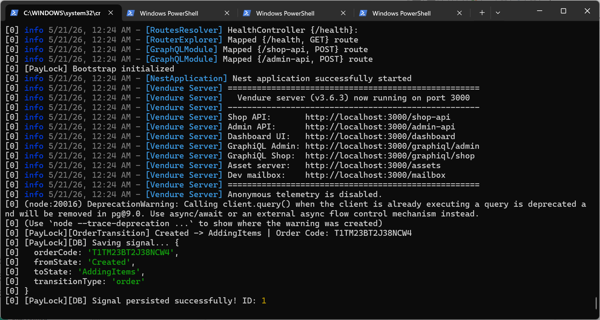
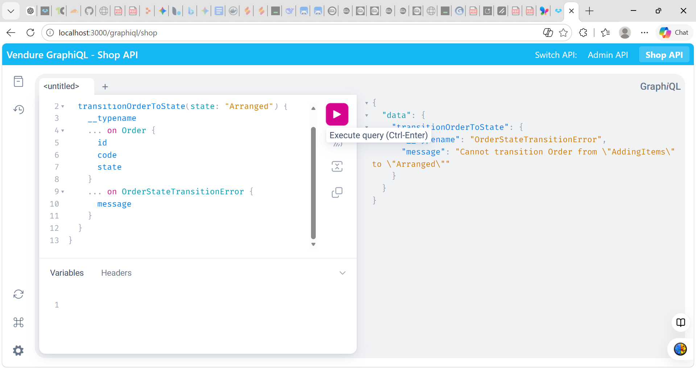
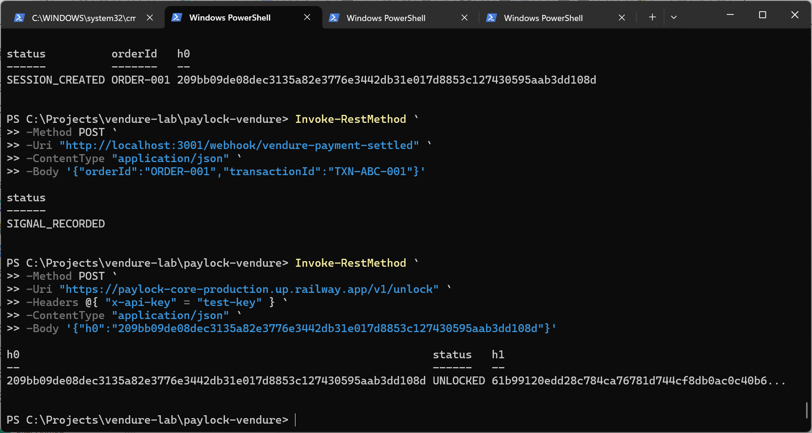
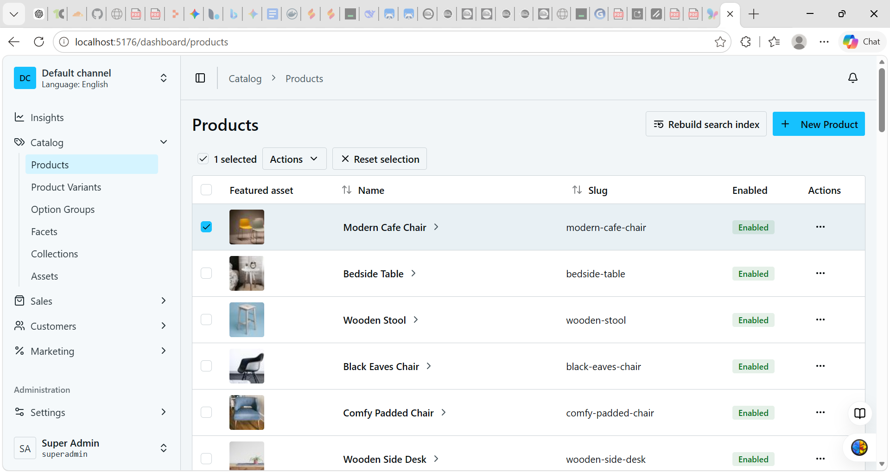

# PayLock x Vendure

This package records the operational evidence produced while embedding PayLock into a live Vendure runtime.

It is not a theoretical note. It is an evidence bundle built from:

- runtime logs
- GraphQL execution traces
- dashboard screenshots
- PowerShell invocation records
- a preserved PDF artifact

## What This Vendure Package Proves

The current Vendure evidence proves:

- embedded PayLock runtime participation inside Vendure
- PayLock bootstrap and event handling during Vendure startup
- real order activity observed through Vendure Shop API
- persisted PayLock signal telemetry
- webhook-driven provider-side signal recording
- PayLock unlock execution against the same session
- H1 issuance after operational convergence

In practical terms, this means Vendure has already demonstrated:

`runtime integration -> provider signal recording -> unlock -> H1 issuance`

## What It Does Not Yet Prove At Medusa Strength

This package does **not** yet show the same guarded transition pair already demonstrated in Medusa:

- deny before proof
- allow after proof

So the current Vendure status should be described precisely as:

**embedded runtime integration plus partial deterministic lifecycle proof**

not yet a complete guarded transition proof.

## Canonical Reading

Vendure is currently proving that PayLock can participate inside the runtime lifecycle as an execution witness and convergence component.

It is not yet proving a final Vendure-side guarded state transition at the same level of completeness shown in Medusa.

## Key Evidence

### 1. Vendure runtime bootstraps with PayLock active

This screenshot shows:

- Vendure server startup
- PayLock bootstrap initialization
- event-driven order transition capture
- database persistence of a PayLock signal

### 2. Real Shop API execution creates an order-state event

This screenshot shows:

- a real `addItemToOrder` mutation
- a returned order code
- resulting state `AddingItems`

### 3. Webhook-driven provider-side signal plus PayLock unlock/H1 issuance

This screenshot shows:

- session creation
- webhook-triggered signal recording
- PayLock unlock against the same `h0`
- `UNLOCKED` response with `h1`

### 4. Vendure dashboard is live with real catalog and customer data

The dashboard screenshots establish that this was not an isolated mock script. The evidence came from a live Vendure runtime with real UI, product, and customer context.

## Included Artifacts

- [Observed Behaviors](./OBSERVED_BEHAVIORS.md)
- [Failure Cases](./FAILURE_CASES.md)
- [Evidence Index](./EVIDENCE_INDEX.md)
- [Runtime Evidence PDF](./evidence/Paylock%20Vendure%20Runtime%20Evidence%20Artifact%20V1.pdf)

## Canonical Verdict

**Vendure currently proves embedded runtime integration plus webhook-driven provider acknowledgement and H1 issuance.**

That is already meaningful operational evidence.

The next milestone, if pursued later, is explicit guarded transition evidence inside Vendure itself.
